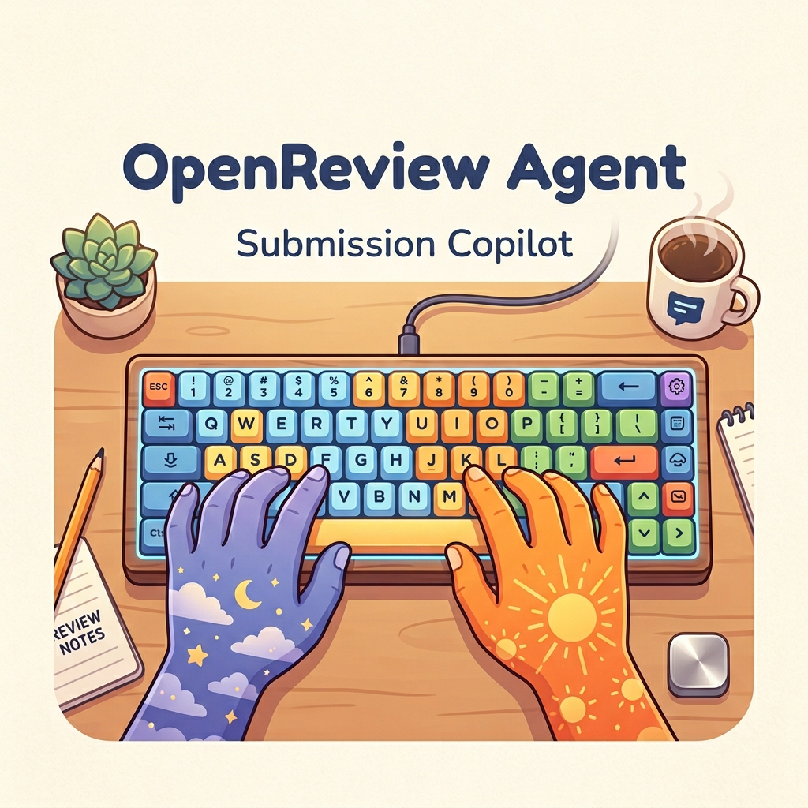

# 🚀 OpenReview Agent

  

  <strong>Agent skill and CLI toolkit for safe OpenReview submission workflows.</strong>

  • Submission Copilot • Cross-Venue Transfer • Dry-Run-First OpenReview Automation •

  <a href="README.zh-CN.md">中文文档</a> •
  <a href="#-features">Features</a> •
  <a href="#-quick-start">Quick Start</a> •
  <a href="#-workflows">Workflows</a> •
  <a href="#-safety-model">Safety Model</a> •
  <a href="SKILL.md">Agent Guide</a> •
  <a href="SECURITY.md">Security</a>

  
  
  
  
  
  

> [!IMPORTANT]
> **📚 From manual forms to submission-native agents.**  
> I was transferring two papers on OpenReview with a dozen-plus coauthors. Every venue field opened another checklist: author profile IDs, schema keys, reviewer nominations, LLM usage declarations, dataset/code links, PDFs, checklists, and conference-specific policies. After too many repeated clicks, I wondered: why is this still not agent-native?
>
> **🧭 Ten minutes with an agent.**  
> I talked through the pain with a coding agent, and it became this project: a local tool that helps researchers inspect, plan, validate, explain, and dry-run OpenReview edits before anything is written.
>
> **🔓 Why open source it?**  
> Many OpenReview automations live in private scripts. OpenReview Agent provides an inspectable, reproducible, dry-run-first skill and CLI layer for safer submission workflows.

## 🧭 Quick Navigation

> [!TIP]
> **I'm a human** -> Continue reading this README for setup, workflows, safety boundaries, and project context.
>
> **I'm an agent** -> Read [SKILL.md](SKILL.md) for operating rules, status codes, command contracts, and recovery patterns.

`openreview-agent` is an agent skill and CLI toolkit that helps AI agents and researchers inspect OpenReview submissions, match author profiles with affiliation evidence, edit metadata safely, plan cross-venue transfers, and create dry-run-first batch submissions.

- **For authors**: avoid deadline-night mistakes in author IDs, venue fields, attachments, and reviewer nomination.
- **For agents**: use structured commands instead of ad-hoc one-off Python snippets.
- **For OpenReview safety**: inspect first, generate payloads second, write only with explicit confirmation.

**Status:** `0.1.0-alpha`

> Not affiliated with OpenReview, NeurIPS, ICLR, ICML, CVPR, ECCV, or any conference organization. Use only with accounts, venues, and data you are authorized to access.

## ⚡ Quick Start

Tell your coding agent:

> Install OpenReview Agent from https://github.com/OpenClaudex/openreview-agent and set it up for safe, dry-run-first OpenReview submission workflows.

OpenReview credentials can be provided through a token, environment variables, or the interactive prompt. Low-level command details live in [SKILL.md](SKILL.md), not in this README.

## ✨ Features

OpenReview Agent focuses on author-side OpenReview workflows:

- Inspects existing forum notes, signatures, readers/writers, license, content keys, and editable invitation fields.
- Matches OpenReview profiles using author name plus affiliation/history evidence.
- Fetches source submission metadata for cross-venue transfer planning.
- Maps source fields to target venue invitation schemas with enum, length, author, anonymity, and duplicate checks.
- Generates dry-run `post_note_edit` payloads before any write.
- Applies transfer edits only with explicit confirmation flags.
- Batch-creates independent submissions from JSON / JSONL with dry-run-first safeguards.
- Avoids default custom `readers`, `writers`, and `nonreaders`; venue processes should own permissions unless explicitly overridden.

## 🧩 Workflows

| Tier | Workflow | Expected Behavior |
|---|---|---|
| Stable | Inspect existing submissions | Read note metadata, authors, authorids, content keys, license, and editable schema |
| Stable | Profile matching | Rank candidate OpenReview profiles by name and affiliation evidence |
| Stable | Cross-venue transfer preflight | Fetch source note, plan field mapping, validate target schema, emit dry-run payload |
| Stable | Safe apply | Write only after explicit confirmation, then re-check OpenReview state |
| Limited | Batch submissions | JSON/JSONL input, attachment handling, per-record errors, user-owned policy responsibility |
| Best-effort | Venue-specific custom forms | Schema fallback and manual verification recommended |

## 🛡️ Safety Model

OpenReview Agent treats every write as high-risk.

- **Dry-run by default.** Transfer and batch commands do not write unless explicit apply flags are present.
- **Schema-aware writes.** Target invitation schema decides which content fields are allowed.
- **No silent author guessing.** Low-confidence author profile matches should be confirmed by a human.
- **No default complex permissions.** The tool does not invent `readers`, `writers`, or `nonreaders` by default.
- **No credential persistence.** Tokens/passwords must not be written to logs, payload files, screenshots, or examples.
- **No review generation or spam.** The project is not a review bot and not a bulk-submission spam tool.

Read [SECURITY.md](SECURITY.md) before using this on private venues or live submissions.

## 🧪 Why This Exists

OpenReview is powerful, but author-side workflows are fragile. A small metadata mistake can mis-assign authorship, break reviewer matching, leak anonymity, miss a required declaration, or fail at the last minute because a venue-specific field changed.

OpenReview Agent is not a full reviewing system. It is a local execution layer for safer submission workflows: inspect, plan, dry-run, apply, and verify.

## 📚 Docs

- [Agent Guide](SKILL.md)
- [Security Policy](SECURITY.md)
- [Release Checklist](docs/release-checklist.md)
- Venue templates: [`config/venues`](config/venues)
- CLI tools: [`scripts/or_transfer.py`](scripts/or_transfer.py), [`scripts/or_batch.py`](scripts/or_batch.py)

## 🗺️ Roadmap

- **v0.1**: inspect, profile-match, one-command transfer dry-run/apply, batch submission dry-run/apply.
- **v0.2**: review-aware transfer preflight from source reviews, meta-review, and decision.
- **v0.3**: public review-pattern analysis by target venue and area.
- **v0.4**: resubmission summary-of-changes drafting with human approval.

## 🌐 Related Projects

OpenReview Agent focuses on author-side submission workflows. Related projects:

- [OpenReview](https://openreview.net/) - open platform for peer review.
- [openreview-py](https://github.com/openreview/openreview-py) - official Python client for OpenReview.
- [openreview/openreview-mcp](https://github.com/openreview/openreview-mcp) - MCP server for `openreview-py` knowledge and introspection.
- [OpenCodice-Research/openreview-mcp](https://github.com/OpenCodice-Research/openreview-mcp) - read-oriented MCP for submissions, reviews, rebuttals, and decisions.

## ⭐ Star History

<a href="https://star-history.com/#OpenClaudex/openreview-agent&Date">
  <picture>
    <source media="(prefers-color-scheme: dark)" srcset="https://api.star-history.com/svg?repos=OpenClaudex/openreview-agent&type=Date&theme=dark" />
    <source media="(prefers-color-scheme: light)" srcset="https://api.star-history.com/svg?repos=OpenClaudex/openreview-agent&type=Date" />
    
  </picture>
</a>

## 📄 License

[MIT](LICENSE)

---

  If this project helps you avoid an OpenReview deadline mistake, please give it a ⭐ Star!

  <a href="https://github.com/OpenClaudex/openreview-agent/issues">Report Issues</a> ·
  <a href="https://github.com/OpenClaudex/openreview-agent/issues/new?labels=enhancement">Feature Requests</a>

